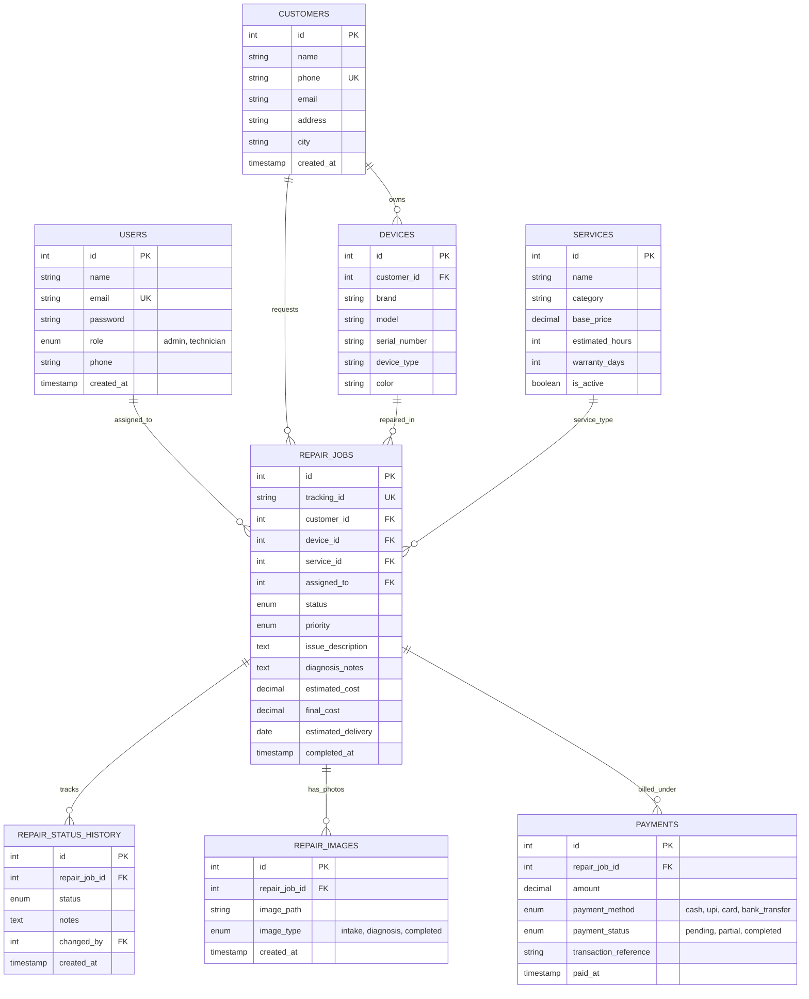

# ⚡ TechFix — Enterprise Laptop Repair & Service Management System

<div align="center">


**TechFix** is a complete, production-ready full-stack web application and repair shop management portal tailored for laptop and computer repair centers. Built with a custom lightweight **PHP MVC architecture**, **Vanilla CSS design system**, and **MySQL**, it provides an intuitive public booking and tracking portal for customers alongside an administrative management console for technicians and store managers.

[Key Features](#-key-features) • [System Architecture](#-system-architecture) • [Directory Structure](#-directory-structure) • [Installation & Setup](#-installation--setup) • [Database Schema](#-database-schema--seeding) • [Routing & Endpoints](#-routes--endpoints-reference) • [Configuration](#-environment-variables) • [Production Deployment](#-production-deployment)

</div>

---

## 🌟 Key Features

### 💻 1. Customer-Facing Portal
* **High-Conversion Landing Page**:
  * **Interactive Problem Diagnosis Tool**: Customers select their device symptoms (e.g. *No Display*, *Water Damage*, *Battery Swelling*, *Blue Screen*) to get instant repair suggestions, estimated time, and cost estimates.
  * **Services Catalog**: Categorized repair services (Motherboard repair, Screen replacement, Hinges repair, Keyboard replacement, SSD/RAM upgrade, OS reinstallation) with transparent pricing and warranty duration tags.
  * **Visual Proof Gallery**: Before & after showcase highlighting real chip-level repair work.
  * **Trust Metrics & Google-Style Reviews**: Customer feedback, verified ratings, and service guarantees.
  * **Direct Contact Channels**: WhatsApp click-to-chat integration, emergency call button, and Google Maps location card.
* **Online Repair Booking Flow**:
  * Multi-step customer intake (Brand, Model, Serial/IMEI, Issue Description, Pickup/Drop-off type, Preferred date/time).
  * Unique **Tracking ID Generation** (e.g., `AMN-LR-20260821-4821`).
  * Instant printable booking receipt with repair ID, terms, and estimate summary.
* **Live Real-Time Repair Tracker**:
  * Public lookup using Customer Phone Number or Repair ID.
  * Visual progress stepper (Received ➔ Diagnosing ➔ Waiting for Parts ➔ In Progress ➔ Quality Testing ➔ Ready for Pickup ➔ Delivered).
  * Live technician notes, estimated delivery timestamp, repair diagnostic images, and payment status breakdown.

---

### 🛡️ 2. Admin & Technician Portal
* **Role-Based Authentication & Session Security**:
  * Secure credential authentication with password hashing (`password_hash` / `Argon2id`/`Bcrypt`).
  * Session protection with strict session hijacking and timeout countermeasures.
  * CSRF token protection for all state-altering POST/PUT/DELETE requests.
* **Store Operations Dashboard**:
  * Live KPI statistics: *Active Jobs*, *Pending Approvals*, *Ready for Delivery*, *Today's Revenue*, and *Monthly Completion Rate*.
  * Real-time activity feed showing technician assignments, status updates, and recent customer intakes.
* **Repair Job Queue Management**:
  * Full CRUD operations for repair tickets.
  * Advance status updater with technician notes and customer-visible comments.
  * Automatic historical audit logging in `repair_status_history`.
  * Multi-image upload support for documenting device condition at intake and post-repair proof.
* **Technician & Staff Management**:
  * Technician directory with active repair job counts and contact details.
  * Task assignment based on skill level and workload.
* **Customer CRM**:
  * Searchable directory of customer profiles, contact numbers, email addresses, and repair history.
* **Service & Pricing Catalog Management**:
  * Admin interface to add, update, or deactivate repair services, standard labor rates, and warranty policies.
* **Payment & Invoice Tracking**:
  * Payment records (Cash, UPI, Card, Bank Transfer) with partial payments, balances due, and invoice generation.

---

## 🏛️ System Architecture

TechFix follows the **Model-View-Controller (MVC)** design pattern with dedicated service layers and middleware filters:

```
[ HTTP Request: /admin/repairs/update ]
                     │
                     ▼
           [ public/index.php ] ── (Front Controller)
                     │
                     ▼
           [ app/Core/Router.php ]
                     │
           ├── [ Middleware Pipeline ]
           │    ├── CsrfMiddleware
           │    ├── AuthMiddleware
           │    └── AdminMiddleware
           │
                     ▼
      [ app/Controllers/Admin/RepairController.php ]
           │                         │
           ▼                         ▼
   [ app/Services/ ]         [ app/Models/ ]
   • RepairService           • RepairJob
   • UploadService           • Customer
   • TrackingService         • Payment
           │                         │
           └────────────┬────────────┘
                        ▼
             [ app/Core/Database.php ] ── (PDO Prepared Statements)
                        │
                        ▼
                 [ MySQL Database ]
                        │
                        ▼
             [ resources/views/ ] ── (Rendered HTML + Layouts)
```

### Architectural Highlights:
1. **Zero External Framework Overhead**: Pure PHP 8.1+ with zero bloated dependencies — lightning-fast response times (<15ms).
2. **Safe Database Layer**: Centralized `PDO` singleton wrapper with prepared statements preventing SQL injections.
3. **Dedicated Public Web Root**: Only `public/index.php` and public assets are exposed to the web. Core logic, `.env`, configuration, and internal storage remain protected outside the document root.
4. **Service Layer Abstraction**: Business logic is separated from HTTP controllers into testable services (`BookingService`, `TrackingService`, `UploadService`, `RepairService`).

---

## 📂 Directory Structure

```
aman-laptop-reparing/
│
├── app/                                 # Application Core & Business Logic
│   ├── Controllers/                     # HTTP Request Controllers
│   │   ├── HomeController.php           # Frontend Landing & Service Pages
│   │   ├── BookingController.php        # Customer Intake & Booking Processing
│   │   ├── TrackingController.php       # Repair Status Lookup API & Views
│   │   ├── ContactController.php        # Customer Inquiries & Contact Forms
│   │   └── Admin/                       # Administrative Management Controllers
│   │       ├── AuthController.php       # Admin Login, Logout & Session Guard
│   │       ├── DashboardController.php  # Metric Stats & Operations Overview
│   │       ├── RepairController.php     # Repair Tickets, Status Updates & Images
│   │       ├── CustomerController.php   # Customer Records & CRM
│   │       ├── TechnicianController.php # Staff Allocation & Profiles
│   │       └── ServiceController.php    # Service Catalog & Price Management
│   │
│   ├── Core/                            # MVC Framework Infrastructure
│   │   ├── Database.php                 # PDO Connection & Query Builder Helper
│   │   ├── Router.php                   # Fast Dynamic Regex Router
│   │   ├── Controller.php               # Base Controller (View rendering, JSON response)
│   │   ├── Request.php                  # Request Parsing, Input Sanitization & Files
│   │   └── Session.php                  # Secure Session Management & Flash Messages
│   │
│   ├── Middleware/                      # HTTP Request Guards
│   │   ├── AuthMiddleware.php           # Authenticated User Verification
│   │   ├── AdminMiddleware.php          # Admin Privileges Guard
│   │   └── CsrfMiddleware.php           # Anti-CSRF Token Validation
│   │
│   ├── Models/                          # Domain Entity Models
│   │   ├── User.php                     # Admin & Staff Users
│   │   ├── Customer.php                 # Customer Profiles
│   │   ├── Device.php                   # Registered Devices (Laptops/PCs)
│   │   ├── Service.php                  # Repair Catalog Items
│   │   ├── RepairJob.php                # Repair Ticket Entity & Queries
│   │   ├── RepairStatusHistory.php      # Audit Trail of Status Changes
│   │   ├── RepairImage.php              # Intake/Diagnostic Photos
│   │   └── Payment.php                  # Billing & Transaction Records
│   │
│   └── Services/                        # Reusable Business Services
│       ├── BookingService.php           # Customer Booking Transactions
│       ├── RepairService.php            # Lifecycle & Job Status Handling
│       ├── TrackingService.php          # Public Tracking Data Aggregator
│       ├── TrackingIdGenerator.php      # Collision-Resistant ID Formatter
│       └── UploadService.php            # Secure Multi-File Upload Handler
│
├── config/                              # Configuration Files
│   ├── app.php                          # App Name, Debug Mode, Secret & URLs
│   └── database.php                     # Database Connection Credentials
│
├── database/                            # Migrations & Seeds
│   ├── migrations/
│   │   └── 001_initial_schema.sql       # Full Database DDL Schema (8 Tables)
│   └── seed_admin.php                   # Initial Super Admin Account Generator
│
├── public/                              # Public Web Server Root
│   ├── .htaccess                        # Apache URL Rewriting to index.php
│   ├── index.php                        # Single Entry Point (Bootstrap & Routing)
│   ├── assets/                          # Public Frontend Assets (CSS, JS, SVG)
│   │   ├── css/styles.css               # Complete UI Design System & Component Library
│   │   ├── js/main.js                   # Interactive Booking, Diagnosis & Tracker Logic
│   │   └── images/logo.svg              # Brand Logo Asset
│   └── admin-assets/                    # Admin Portal Assets
│       ├── css/styles.css               # Admin Dashboard Layout & Grid System
│       ├── css/auth.css                 # Admin Login & Auth Styling
│       ├── js/script.js                 # Admin UI Interactivity, Modals & Filters
│       ├── js/auth.js                   # Auth Form Validation
│       └── images/                      # Dashboard Icons & Brand Marks
│
├── resources/                           # View Templates & Layouts
│   └── views/
│       ├── layouts/                     # Master Templates
│       │   ├── main.php                 # Public Customer Master Layout (Nav & Footer)
│       │   ├── admin.php                # Admin Dashboard Sidebar, Header & Layout
│       │   └── none.php                 # Blank Canvas Layout (for Print/JSON/Auth)
│       ├── frontend/                    # Customer Pages
│       │   ├── home.php                 # Homepage (13 Interactive Sections)
│       │   ├── pricing.php              # Price Lists, Category Tabs & Inclusions
│       │   ├── booking.php              # Multi-Step Repair Booking Page
│       │   ├── tracking.php             # Repair Lookup & Search Interface
│       │   └── repair-result.php        # Live Status & Timeline Display
│       └── admin/                       # Admin Views
│           ├── login.php                # Administrator Login View
│           ├── dashboard.php            # Main Statistics Dashboard
│           ├── repairs/                 # Repair Management (Index, Create, View)
│           ├── customers/               # Customer Database Directory
│           ├── technicians/             # Technician List & Add Form
│           └── services/                # Service Catalog Table & Modals
│
├── storage/                             # Protected Storage (Not accessible via URL)
│   ├── logs/                            # Application Error & Access Logs
│   └── uploads/                         # Uploaded Repair Device Images & Receipts
│
├── .env.example                         # Environment Variables Template
├── .htaccess                            # Root Redirect to public/
├── .gitignore                           # Git Ignored Patterns
├── composer.json                        # Composer Dependencies & PSR-4 Autoloading
└── README.md                            # Project Documentation
```

---

## 🚀 Installation & Setup

### System Prerequisites
Make sure your environment meets the following specifications:
* **PHP**: `>= 8.1` (with `pdo`, `pdo_mysql`, `mbstring`, `fileinfo`, `openssl` extensions enabled)
* **Database**: MySQL `>= 8.0` or MariaDB `>= 10.4`
* **Web Server**: Apache (`mod_rewrite` enabled) or Nginx
* **Package Manager**: [Composer](https://getcomposer.org/)

---

### Step-by-Step Installation

#### 1. Clone the Repository
```bash
git clone https://github.com/amanprojects-ops/techfix-laptop-repair-website.git
cd techfix-laptop-repair-website
```

#### 2. Install Composer Dependencies
```bash
composer install
```

#### 3. Configure Environment File
Copy the sample environment file to `.env`:
```bash
cp .env.example .env
```
Edit `.env` with your actual MySQL database credentials and settings:
```env
APP_NAME=TechFix
APP_ENV=local
APP_DEBUG=true
APP_SECRET=your_super_secret_key_change_me_to_32_chars_min
APP_URL=http://localhost:8000

DB_HOST=127.0.0.1
DB_PORT=3306
DB_NAME=techfix_repair
DB_USER=root
DB_PASS=your_mysql_password

TRACKING_PREFIX=AMN-LR
UPLOAD_MAX_SIZE=5242880
```

#### 4. Import Database Schema & Create Admin User
1. Create the database in MySQL:
```sql
CREATE DATABASE techfix_repair CHARACTER SET utf8mb4 COLLATE utf8mb4_unicode_ci;
```
2. Import the complete relational schema:
```bash
mysql -u root -p techfix_repair < database/migrations/001_initial_schema.sql
```
3. Run the admin seeder script:
```bash
php database/seed_admin.php
```

#### 5. Set Storage Permissions
Ensure the web server has write permissions for `storage/`:
```bash
# Linux / macOS
chmod -R 775 storage/
chmod -R 775 storage/logs/ storage/uploads/

# Windows
# Ensure your user account or web server process (IUSR/Apache) has write access to storage/
```

#### 6. Run the Application

##### Option A: Using PHP's Built-In Development Server (Fastest)
```bash
composer start
```
*Public Website:* `http://localhost:8000`  
*Admin Portal:* `http://localhost:8000/admin/login`

##### Option B: Using XAMPP / WampServer / Laragon
1. Move/clone the project inside `htdocs/` (e.g. `C:/xampp/htdocs/aman-laptop-reparing`).
2. Start **Apache** and **MySQL** in XAMPP Control Panel.
3. Access via browser: `http://localhost/aman-laptop-reparing/public/`

---

## 🔐 Default Credentials

| Portal | URL | Username / Email | Password | Role |
|---|---|---|---|---|
| **Admin Console** | `/admin/login` | `admin@techfix.in` | `admin123` | Super Admin |

> ⚠️ **Security Notice**: Immediately change the default admin password in production via your profile or database.

---

## 🗄️ Database Schema & Seeding

The application uses an optimized relational database schema comprising 8 normalized tables with foreign key constraints:



---

## 🛣️ Routes & Endpoints Reference

### 🌐 Frontend Routes (`routes/web.php`)

| Method | URI | Controller Action | Description |
|---|---|---|---|
| `GET` | `/` | `HomeController@index` | Main Homepage with diagnosis tool & services |
| `GET` | `/pricing` | `HomeController@pricing` | Full service pricing table & warranty specs |
| `GET` | `/contact` | `ContactController@index` | Store location, contact details & inquiries |
| `POST` | `/contact/submit` | `ContactController@submit` | Handle customer contact inquiry form |
| `GET` | `/book-repair` | `BookingController@index` | Customer intake & repair booking page |
| `POST` | `/book-repair` | `BookingController@store` | Process booking & generate Tracking ID |
| `GET` | `/track-repair` | `TrackingController@index` | Public repair tracker search interface |
| `GET` | `/track-repair/status` | `TrackingController@search` | Search status by ID or Phone Number |
| `GET` | `/track-repair/{id}` | `TrackingController@view` | Dynamic live repair timeline & diagnostics |

---

### 🔒 Admin Portal Routes (`routes/admin.php`)

| Method | URI | Controller Action | Middleware | Description |
|---|---|---|---|---|
| `GET` | `/admin/login` | `Admin\AuthController@login` | Guest | Display admin login form |
| `POST` | `/admin/login` | `Admin\AuthController@authenticate` | Guest, CSRF | Validate credentials & set session |
| `POST` | `/admin/logout` | `Admin\AuthController@logout` | Auth | Terminate admin session |
| `GET` | `/admin/dashboard` | `Admin\DashboardController@index` | Auth, Admin | Overview stats, graphs & active jobs |
| `GET` | `/admin/repairs` | `Admin\RepairController@index` | Auth, Admin | List, filter, and search repair tickets |
| `GET` | `/admin/repairs/create` | `Admin\RepairController@create` | Auth, Admin | Intake form for new walk-in devices |
| `POST` | `/admin/repairs/store` | `Admin\RepairController@store` | Auth, Admin, CSRF | Save new repair ticket & upload photos |
| `GET` | `/admin/repairs/{id}` | `Admin\RepairController@show` | Auth, Admin | Complete job view, timeline & invoice |
| `POST` | `/admin/repairs/{id}/status`| `Admin\RepairController@updateStatus`| Auth, Admin, CSRF | Update status & add stage notes |
| `POST` | `/admin/repairs/{id}/assign`| `Admin\RepairController@assignTech` | Auth, Admin, CSRF | Assign job to specific technician |
| `GET` | `/admin/customers` | `Admin\CustomerController@index` | Auth, Admin | Customer list with repair history |
| `GET` | `/admin/technicians` | `Admin\TechnicianController@index` | Auth, Admin | List technician workloads & stats |
| `POST` | `/admin/technicians/create`| `Admin\TechnicianController@store`| Auth, Admin, CSRF | Add a new technician account |
| `GET` | `/admin/services` | `Admin\ServiceController@index` | Auth, Admin | View and manage repair service catalog |
| `POST` | `/admin/services/store` | `Admin\ServiceController@store` | Auth, Admin, CSRF | Create or update catalog repair items |

---

## ⚙️ Environment Variables

The application is configured using a central `.env` file loaded through `vlucas/phpdotenv`:

| Variable | Type | Default | Description |
|---|---|---|---|
| `APP_NAME` | String | `TechFix` | Display brand name across the platform |
| `APP_ENV` | String | `local` | `local` (verbose errors) or `production` |
| `APP_DEBUG` | Boolean | `true` | Show descriptive stack traces when true |
| `APP_SECRET` | String | *Random 32 char* | Key used for CSRF token salts and encryption |
| `APP_URL` | String | `http://localhost:8000` | Base URL for absolute asset links & routing |
| `DB_HOST` | String | `127.0.0.1` | MySQL Database host |
| `DB_PORT` | Number | `3306` | MySQL Port |
| `DB_NAME` | String | `techfix_repair` | Database name |
| `DB_USER` | String | `root` | Database username |
| `DB_PASS` | String | `""` | Database password |
| `TRACKING_PREFIX` | String | `AMN-LR` | Prefix used when generating repair job numbers |
| `UPLOAD_MAX_SIZE` | Bytes | `5242880` (5MB) | Maximum allowed file upload size per image |

---

## 🎨 Design System & UI Specifications

The UI is built with a custom **CSS Design Token Architecture** without bulky CSS frameworks:

```css
:root {
  /* Brand Color Palette */
  --primary:        #2563EB;   /* TechFix Electric Blue */
  --primary-dark:   #1D4ED8;   /* Hover & Active States */
  --primary-light:  #DBEAFE;   /* Light Accent & Badge backgrounds */
  --accent-emerald: #10B981;   /* Success & "Ready for Pickup" */
  --accent-amber:   #F59E0B;   /* In Progress & Warnings */
  --accent-rose:    #EF4444;   /* High Priority & Critical Alerts */

  /* Neutral Dark/Light Tokens */
  --bg-body:        #F8FAFC;   /* Light Background */
  --bg-card:        #FFFFFF;   /* Clean Card Surfaces */
  --bg-dark:        #0A0F1E;   /* Deep Blue/Black Contrast */
  --text-main:      #0F172A;   /* Primary Typography */
  --text-muted:     #64748B;   /* Secondary Subtitles */
  --border-color:   #E2E8F0;   /* Clean Dividers */

  /* Typography & Radius */
  --font-family:    'Inter', system-ui, -apple-system, sans-serif;
  --radius-sm:      8px;
  --radius-md:      12px;
  --radius-lg:      16px;
  --radius-xl:      24px;
}
```

---

## 🛡️ Security Implementation

* **SQL Injection Prevention**: 100% of database queries utilize parameterized prepared statements via PDO. No raw variables are interpolated into queries.
* **XSS Countermeasures**: All user-provided strings rendered in views are passed through `htmlspecialchars($data, ENT_QUOTES, 'UTF-8')`.
* **CSRF Protection**: All POST forms include a unique `csrf_token()` validated by `CsrfMiddleware`.
* **Secure File Uploads**: Uploaded diagnostic and repair images are verified using MIME-type detection (`image/jpeg`, `image/png`, `image/webp`), randomized UUID filenames, and stored outside the public directory.
* **Strict Session Management**: `HttpOnly`, `SameSite=Lax`, and secure session cookies preventing cross-site scripting session theft.

---

## 🌐 Production Deployment

### Apache (VirtualHost Configuration)
Point the document root directly to the `public/` directory:
```apache
<VirtualHost *:80>
    ServerName techfix.yourdomain.com
    DocumentRoot /var/www/techfix-laptop-repair/public

    <Directory /var/www/techfix-laptop-repair/public>
        Options -Indexes +FollowSymLinks
        AllowOverride All
        Require all granted
    </Directory>

    ErrorLog ${APACHE_LOG_DIR}/techfix_error.log
    CustomLog ${APACHE_LOG_DIR}/techfix_access.log combined
</VirtualHost>
```

### Nginx Configuration
```nginx
server {
    listen 80;
    server_name techfix.yourdomain.com;
    root /var/www/techfix-laptop-repair/public;
    index index.php index.html;

    location / {
        try_files $uri $uri/ /index.php?$query_string;
    }

    location ~ \.php$ {
        include snippets/fastcgi-php.conf;
        fastcgi_pass unix:/var/run/php/php8.1-fpm.sock;
        fastcgi_param SCRIPT_FILENAME $realpath_root$fastcgi_script_name;
        include fastcgi_params;
    }

    location ~ /\.(env|git|htaccess) {
        deny all;
    }
}
```

---

## 📄 License & Attribution

This project is licensed under the **MIT License** — feel free to customize, modify, and deploy for your own computer and electronics repair business.

<div align="center">

**Designed & Developed with ❤️ by [AmanProjects](https://github.com/amanprojects-ops)**

*If this project helped you, please give it a ⭐ on GitHub!*

</div>
